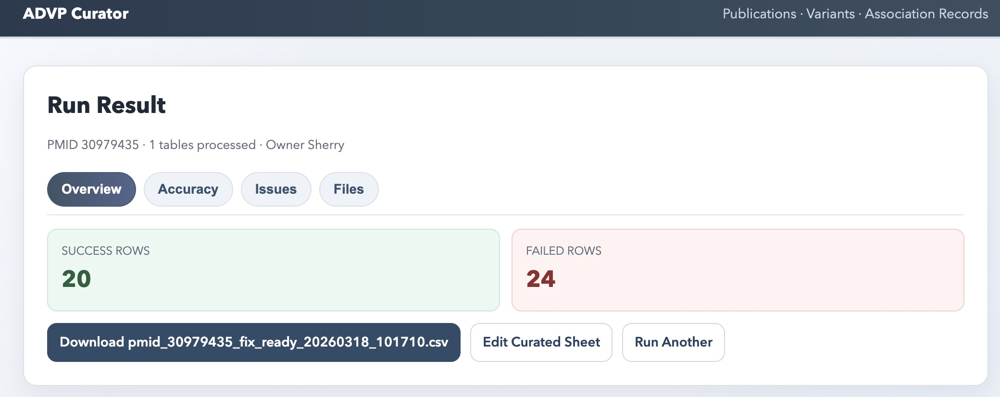
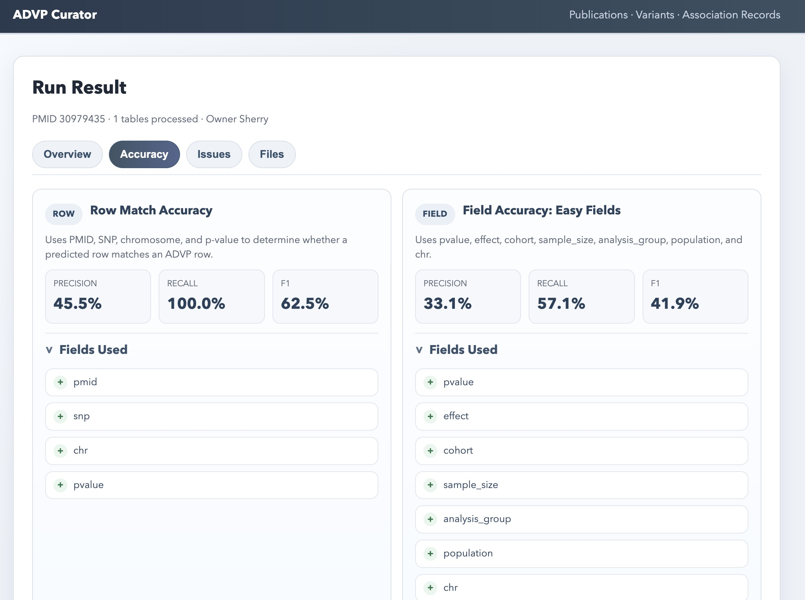

# advp_curator

`advp_curator.py` converts paper tables (PDF/URL/Excel/CSV/HTML) into a fixed ADVP curated schema and exports an Excel file.

## Web UI
The project also includes a lightweight web interface, [`advp_run_ui.py`](./advp_run_ui.py), for running the full curation and validation workflow from a browser.

### What the UI does
- Accepts paper metadata, table links, and the responsible curator name
- Runs the end-to-end workflow:
  - table link to spreadsheet extraction
  - table-to-ADVP column mapping
  - ADVP alignment evaluation
- Shows tabbed result views for:
  - `Overview`
  - `Accuracy`
  - `Issues`
  - `Files`
- Generates downloadable review artifacts such as:
  - `fix_ready.csv`
  - mismatch reports
  - summary and details evaluation files
- Supports direct editing of curated sheets from the browser

### UI screenshots





## Features
- Outputs a fixed set of 46 curated columns (independent of raw table layout)
- Text extraction fallback chain for PDF context fields:
  - `pdfplumber` (default)
  - `Docling` fallback only when Methods/Results signals are weak
  - OCR + page-rotation retry (0/90/180/270) as final rescue
- Section-aware context extraction (`Methods` / `Results` / `Supplement`) for:
  - `Population`, `Cohort`, `Sample size`, `Imputation_simple2`, `Stage`, `Model type`
- Abbreviation expansion and semantic column mapping to curated references
  - e.g. `ADGC/IGAP/HRC/TOPMed` normalization
  - low-confidence mapping score (`< 0.4`) flagged as `needs_review`
- Generic subgroup melt/group logic for multi-header GWAS tables
- Supports input sources:
  - PDF path / PDF URL
  - table URL
  - `.xlsx` / `.xls` / `.csv` / `.tsv` / `.html`
- Automatic header detection (including `Unnamed:*` columns)
- SNP/gene table mapping rules
- `chr:position` parsing (for example `20:45269867`)
- `EA/OA` and `Major/minor` allele parsing
- Prioritizes `P value All` when multiple p-value columns exist
- Subgroup expansion (one SNP row can expand into multiple records)
  - For example `i-Share (dichotomous)` / `i-Share (continuous)` / `Nagahama (...)`
- Generates `RecordID` and `TableIDX` (format `T00001`)
- Generates audit JSON (field evidence and parsing errors)

## Installation
```bash
python3 -m pip install pandas openpyxl requests pdfplumber camelot-py lxml
```

Optional (for fallback rescue quality):
```bash
python3 -m pip install docling pymupdf pytesseract pillow
```

## Usage

### 1) Interactive mode (recommended)
```bash
python3 advp_curator.py
```
The script will prompt for:
- input source path/URL
- output xlsx path
- paper_id
- audit json path

### 2) CLI mode
#### Table file
```bash
python3 advp_curator.py \
  --table_input "/path/to/table.xlsx" \
  --out "/path/to/curated.xlsx" \
  --paper_id "37069360_table1"
```

#### PDF
```bash
python3 advp_curator.py \
  --input "/path/to/paper.pdf" \
  --out "/path/to/curated.xlsx" \
  --paper_id "paper_001"
```

#### Table URL
```bash
python3 advp_curator.py \
  --table_input "https://example.com/table/1" \
  --out "/path/to/curated.xlsx" \
  --paper_id "paper_table1"
```

### 3) Web UI mode
Start the local UI:

```bash
python3 advp_run_ui.py web --host 127.0.0.1 --port 8899
```

Then open:

```text
http://127.0.0.1:8899
```

### How to use the UI
1. Enter the curator name in `Owner`
2. Enter the paper `PMID`
3. Provide the paper PDF path
4. Paste one or more PMC table links
5. Confirm the ADVP TSV path
6. Click `Run`

### What the UI shows after a run
- `Overview`
  - processed table count
  - success rows
  - failed rows
  - download button for `fix_ready.csv`
- `Accuracy`
  - `Row Match Accuracy`
  - `Field Accuracy: Easy Fields`
  - `Field Accuracy: All Mapped ADVP Fields`
- `Issues`
  - `Predicted But Not In ADVP`
  - `In ADVP But Missing From Prediction`
  - `Missing ADVP Fields`
- `Files`
  - summary CSV path
  - details JSON path
  - fix file path
  - run log path

### Accuracy views in the UI
- `Row Match Accuracy`
  - Uses `PMID`, `SNP`, `chromosome`, and `p-value` as the row matching key
- `Field Accuracy: Easy Fields`
  - Compares `pvalue`, `effect`, `cohort`, `sample_size`, `analysis_group`, `population`, and `chr`
- `Field Accuracy: All Mapped ADVP Fields`
  - Compares all currently mapped ADVP-compatible fields available in the evaluator

### Notes
- The current UI workflow intentionally ignores `RA1/RA2` in matching to focus on stabilizing the core mapping fields first
- The browser editor is intended for lightweight manual correction of curated output files
- For multi-table papers, evaluation is performed on the combined prediction set

## Render Demo Deployment
This project can be deployed as a lightweight demo on Render.

### Included deployment files
- [`requirements.txt`](./requirements.txt)
- [`render.yaml`](./render.yaml)

### What the Render demo is good for
- sharing the UI with collaborators
- testing the end-to-end workflow
- demonstrating table extraction, curation, and evaluation in a browser

### Render free plan caveats
- services may sleep when idle
- the first request after sleeping may be slow
- local files are ephemeral and not guaranteed to persist
- uploaded PDFs, generated spreadsheets, and review artifacts should be treated as temporary demo data

### Deploy on Render
1. Push this repository to GitHub
2. Create a new Render account or sign in
3. Click `New` -> `Blueprint`
4. Connect your GitHub repository
5. Render will detect [`render.yaml`](./render.yaml)
6. Deploy the web service

### Start command used on Render
```bash
python3 advp_run_ui.py web --host 0.0.0.0 --port $PORT
```

### Recommended demo usage
- use URL-based paper input when possible
- upload PDFs only for temporary review sessions
- do not rely on the deployed instance for long-term file storage

## Current Field Mapping Rules
- `TopSNP`: `SNP ALL` / `Variant` / `rsID`-like columns
- `SNP-based, Gene-based`: `SNP-based` if rsID exists; otherwise `Gene-based` if a gene column exists
- `Chr`, `BP(Position)`:
  - Prefer parsing from `chr:position`
  - Otherwise use separate `Chr` / `Position` columns
- `RA 1(Reported Allele 1)`, `RA 2(Reported Allele 2)`:
  - `EA/OA` -> `RA1=EA`, `RA2=OA`
  - `Major/minor` -> `RA1=minor`, `RA2=major`
- `ReportedAF(MAF)`: `EAF` / `MAF`
- `LocusName`: `Nearest gene` / `Closest gene`
- `Effect Size Type (OR or Beta)`: inferred from column names (`OR/Beta/HR/Zscore`)
- `EffectSize(altvsref)`: numeric value from the selected effect column
- `P-value`: prefer `P value All`, then `Meta P`, then generic `P value`
- `95%ConfidenceInterval`: `95% CI`-like columns
- `Table Ref in paper`: `Table 1`, `Table 2`, ...
- `TableIDX`: `T00001`, `T00002`, ...

## Outputs
- Curated Excel：`--out` 
- Audit JSON: path from `--audit` (in interactive mode, default is `${paper_id}_audit.json`)

## Troubleshooting
- `No /Root object! - Is this really a PDF?`
  - You likely passed an Excel/CSV file as PDF input. Use `--table_input` or interactive mode with a table file.
- `ImportError: Import lxml failed`
  - Install `lxml`: `python3 -m pip install lxml`
- Table URL only outputs one `NR` row
  - The site may be dynamic or protected. Save the table as `.xlsx/.csv` first, then run with `--table_input`.
