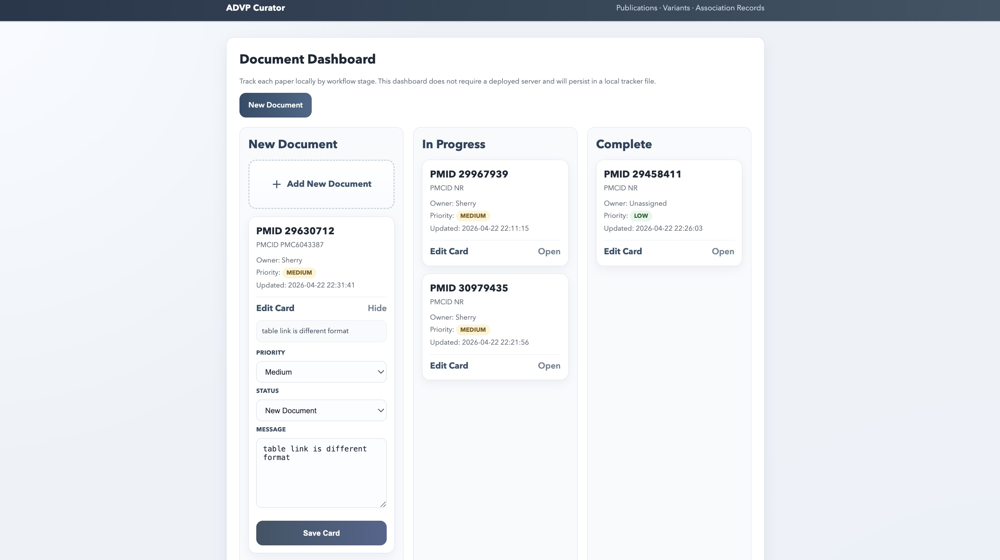

# advp_curator

`advp_curator.py` converts paper tables (PDF/URL/Excel/CSV/HTML) into a fixed ADVP curated schema and exports an Excel file.

## Web UI
The project also includes a lightweight local web interface, [`advp_run_ui.py`](./advp_run_ui.py), for running the curation and evaluation workflow from a browser.

### UI overview
- Local dashboard with three paper stages:
  - `New Document`
  - `In Progress`
  - `Complete`
- Each paper is stored as a local card with:
  - `PMID`
  - `PMCID`
  - owner
  - priority
  - message / note
  - last updated time
- The original run, result, and edit flow is still preserved

### Dashboard screenshot



The homepage dashboard is intended as a local tracker. It helps users see which papers are new, currently under review, or completed, without changing the underlying curation pipeline.

### What the UI does
- Accepts paper metadata, paper source, and table links
- Runs the end-to-end workflow:
  - table link to spreadsheet extraction
  - table-to-ADVP column mapping
  - ADVP alignment evaluation
- Shows tabbed result views for:
  - `Overview`
  - `Accuracy`
  - `Issues`
  - `Files`
- Generates one unified evaluation workbook:
  - `eval_reports/pmid_<PMID>_eval_report_<scope>.xlsx`
- Supports direct editing of curated sheets from the browser
- Stores paper tracker cards locally in:
  - [`project_tracker.json`](./project_tracker.json)

### UI screenshots


## Features
- Outputs a fixed curated schema from heterogeneous paper tables
- MCP-ready callable service layer in [`advp_services.py`](./advp_services.py)
- Text extraction fallback chain for PDF context fields:
  - `pdfplumber`
  - `Docling` fallback when section signal is weak
  - OCR + page-rotation retry as final rescue
- Section-aware context extraction for:
  - `Population`
  - `Cohort`
  - `Sample size`
  - `Imputation_simple2`
  - `Stage`
  - `Model type`
- Table-specific parsing support for multi-header and subgroup tables
- Supports input sources:
  - PDF path / PDF URL
  - table URL
  - `.xlsx` / `.xls` / `.csv` / `.tsv` / `.html`
- Generates `RecordID`, `TableIDX`, curated Excel output, and audit JSON
- Browser editor supports:
  - field-level status (`No Mark`, `Needs Review`, `Issue`, `Resolved`)
  - row-level status summary (`Not Checked`, `Needs Review`, `Issue`, `Checked`)
  - a row-level `Comment` column stored directly in the Excel sheet

## Installation
```bash
python3 -m pip install pandas openpyxl requests pdfplumber camelot-py lxml beautifulsoup4
```

Optional:
```bash
python3 -m pip install docling pymupdf pytesseract pillow
```

## Usage

### 1) Interactive mode
```bash
python3 advp_curator.py
```

### 2) CLI mode
#### Table file
```bash
python3 advp_curator.py \
  --table_input "/path/to/table.xlsx" \
  --out "/path/to/curated.xlsx" \
  --audit "/path/to/audit.json" \
  --paper_id "37069360_table1"
```

#### PDF
```bash
python3 advp_curator.py \
  --input "/path/to/paper.pdf" \
  --out "/path/to/curated.xlsx" \
  --audit "/path/to/audit.json" \
  --paper_id "paper_001"
```

#### Table URL
```bash
python3 advp_curator.py \
  --table_input "https://example.com/table/1" \
  --out "/path/to/curated.xlsx" \
  --audit "/path/to/audit.json" \
  --paper_id "paper_table1"
```

### 3) Web UI mode
Start the local UI:

```bash
python3 advp_run_ui.py web --host 127.0.0.1 --port 8899
```

Then open:

```text
http://127.0.0.1:8899
```

### 4) MCP-ready service functions
The local UI still works the same way, but the core workflow is exposed through
callable functions in [`advp_services.py`](./advp_services.py) and a stdio MCP
server wrapper in [`advp_mcp_server.py`](./advp_mcp_server.py).  This keeps UI
state separate from the agent-callable pipeline:

- `discover_pmc_tables`
- `extract_table`
- `map_to_advp`
- `evaluate_against_advp`
- `open_curated_sheet`
- `run_full_curation`
- `run_curation_workflow`

Tool input/output contracts are listed in [`mcp_tool_schemas.json`](./mcp_tool_schemas.json).

Install the MCP SDK if needed:

```bash
python3 -m pip install mcp
```

Run the MCP server locally:

```bash
ADVP_PROJECT_ROOT="$(pwd)" python3 advp_mcp_server.py
```

The MCP tools restrict local file paths to `ADVP_PROJECT_ROOT`.  The browser UI
remains the human-in-the-loop review layer, while MCP exposes discovery,
extraction, mapping, evaluation, and curated-sheet access to agents.

## How to use the UI

### Dashboard
- `/` opens the local dashboard
- `New Document` opens the paper input form
- `In Progress` cards open the current edit page
- `Complete` cards open the saved run result page
- Each card can store:
  - priority
  - status
  - message / note

### New document form
1. Enter `Owner`
2. Enter `PMID`
3. Optionally enter `PMCID`
4. Provide a `PMC article URL` or upload a `PDF`
5. Paste one or more `Table links`
6. Confirm the ADVP TSV path
7. Click `Run`

### What the UI shows after a run
- `Overview`
  - processed table count
  - success rows
  - failed rows
- `Accuracy`
  - `Row Match Accuracy`
  - `Field Accuracy: Easy Fields`
  - `Field Accuracy: All Mapped ADVP Fields`
- `Issues`
  - `Predicted But Not In ADVP`
  - `In ADVP But Missing From Prediction`
  - `Missing ADVP Fields`
- `Files`
  - unified eval workbook path
  - run log path

## Unified evaluation output
The evaluator now writes one main report:

```text
eval_reports/pmid_<PMID>_eval_report_<scope>.xlsx
```

Typical sheets:
- `advp_gold`
- `predicted_all_tables`
- `missing_from_prediction`
- `extra_prediction`
- `summary`
- `field_accuracy`

If the PMID is not present in ADVP, the report still exports the predicted table sheet, but row-level precision / recall / F1 are not computed.

## Notes on table discovery
- Auto-discovery currently works only with **PMC article URLs**
- A PubMed URL alone is not enough for PMC table auto-discovery
- For PDF-only papers:
  - paste table links manually if available
  - or use manual table upload / `--table_input`
- Some PMC papers use unusual table link patterns and may require manual table URLs
- Some papers present tables as images, which may require manual extraction or OCR-based handling

## Editing behavior
- Empty key fields such as `TopSNP`, `P-value`, `Population_map`, `Analysis group`, and `Phenotype` are auto-marked as `Needs Review`
- Edits to numeric, text, and scientific notation values are saved safely without pandas dtype errors
- Annotation status is stored separately from the Excel body
- Old annotations are ignored if the underlying Excel file has been regenerated

## Outputs
- Curated Excel: path from `--out`
- Audit JSON: path from `--audit`
- Unified eval workbook:
  - `eval_reports/pmid_<PMID>_eval_report_<scope>.xlsx`

## Troubleshooting
- `Auto-discovery currently works only with PMC article URLs`
  - Use a PMC article URL, or paste table links manually, or switch to manual table upload / `--table_input`
- `No /Root object! - Is this really a PDF?`
  - You likely passed an Excel/CSV file as PDF input. Use `--table_input`
- `ImportError: Import lxml failed`
  - Install `lxml`: `python3 -m pip install lxml`
- PMC table link fails to parse
  - Save the table manually as `.xlsx/.csv` and run with `--table_input`
- Browser UI cannot open due to missing modules
  - Install the UI dependencies first, especially `pandas`, `openpyxl`, `beautifulsoup4`, and `lxml`
